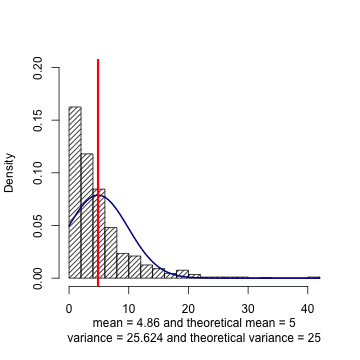
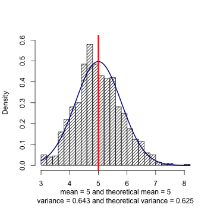

### <b>Introduction</b>
[Reference](https://en.wikipedia.org/wiki/Central_limit_theorem): "In probability theory, the central limit theorem (CLT) states that, given certain conditions, the arithmetic mean of a sufficiently large number of iterates of independent random variables, each with a well-defined expected value and well-defined variance, will be approximately normally distributed, regardless of the underlying distribution."

The exponential distribution is not normally distributed. According to the CLT, the arithmetic mean of a large number of iterations of the exponential distribution should be approximately normally distributed.

I will demonstrate the CLT using a sample size of 1000 iterations of the mean of 40 exponentials.

--- .codefont .outfont .codemargin .outmargin
### <b>Distribution of 1000 exponentials</b>
The density histogram shows that the exponential distribution using lambda = 0.2 is not normally distributed.

```r
set.seed(100)
sim3 <- data.frame(x = rexp(1000, 0.2))
m3=mean(sim3$x); sd3=sd(sim3$x)
hist(sim3$x, density=20, breaks=20, prob=TRUE, xlab=paste0("mean = ", round(m3,2), 
   " and theoretical mean = 5", "\nvariance = ", round(sd3^2,3), 
   " and theoretical variance = 25"), ylim=c(0, 0.2),main="")
curve(dnorm(x, mean=m3, sd=sd3), col="darkblue", lwd=2, add=TRUE, yaxt="n")
abline(v=m3,col="red", lwd=3)
```

 

--- .codefont .outfont .codemargin .outmargin
### <b>Distribution of 1000 iterations of the mean of 40 exponentials</b>
The density histogram shows that for a large number of iterations (1000 used in this example) of the mean of 40 exponentials is approximately normally distributed.

```r
set.seed(100); 
sim2 <- data.frame(x = sapply(1:1000, function(x) {mean(rexp(40, 0.2))}))
m2 <- mean(sim2$x); sd2 <- sd(sim2$x)
hist(sim2$x, density=20, breaks=20, prob=TRUE, xlab=paste0("mean = ", round(m2,3),
   " and theoretical mean = 5", "\nvariance = ", round(sd2^2,3), 
   " and theoretical variance = ", round(25/40,3)), ylim=c(0, .6), main="")
curve(dnorm(x, mean=m2, sd=sd2), col="darkblue", lwd=2, add=TRUE, yaxt="n")
abline(v=m2,col="red", lwd=3)
```

 

---
### <b>Conclusion</b>
Often the distribution of data is not normally distributed making it difficult to calculate statistics. If we are able to have a sufficiently large enough sample size, the Central Limit Theorem enables us to treat the sampling distribution as if it were normally distributed. Through exploratory data analysis we can determine how large of a sample is necessary.

For 1000 iterations of the mean of 40 exponentials, the distribution did become approximately normally distributed.
